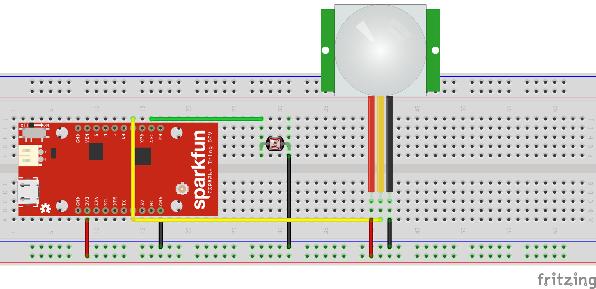

# Capteur de luminosité et de présence

### Materiel

- 1 x PIR
- 1 x Photorésistance
- 1 x Esp8266
- 5 x Fils

### Configuration

N'oubliez pas de configurer les informations dans le fichier arduino :

- WIFI_SSID : L'identifiant de votre box;
- WIFI_PASSWORD : Le mot de passe de votre box;
- REDIS_ADDR : L'adresse de Redis;
- REDIS_PORT : Le port de Redis;
- REDIS_PASSWORD : Le mot de passe de Redis (mettre "" si nous n'en avez pas).

### Branchement

