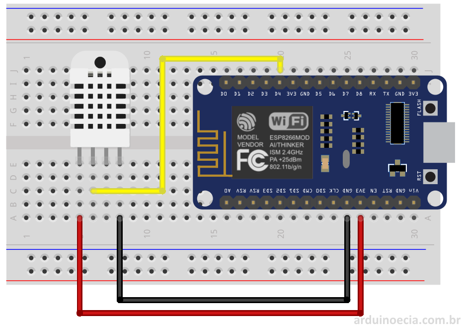

# Module de température

### Materiel

- 1 x DHT22
- 1 x Esp8266
- 3 x Fils

### Configuration

N'oubliez pas de configurer les informations dans le fichier arduino :

- WIFI_SSID : L'identifiant de votre box;
- WIFI_PASSWORD : Le mot de passe de votre box;
- REDIS_ADDR : L'adresse de Redis;
- REDIS_PORT : Le port de Redis;
- REDIS_PASSWORD : Le mot de passe de Redis (mettre "" si nous n'en avez pas);
- DHT_PIN : La broche sur lequel est branché votre capteur;
- DHT_TYPE : Le type de capteur (DHT11 ou DHT22).

### Branchement

